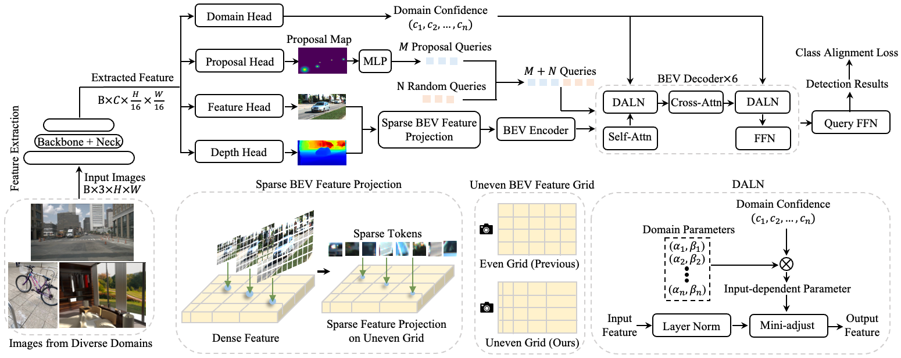

# UniMODE & MM-UniMODE

**UniMODE: Unified Monocular 3D Object Detection**

**Towards Unified 3D Object Detection via Algorithm and Data Unification**

[Zhuoling Li][zl], [Xiaogang Xu][xx], [Ser-Nam Lim][sl], [Hengshuang Zhao][hz]

[[`Project Page`](https://lizhuoling.github.io/UniMODE_webpage/)] [[`UniMODE Paper`](https://openaccess.thecvf.com/content/CVPR2024/html/Li_UniMODE_Unified_Monocular_3D_Object_Detection_CVPR_2024_paper.html)] [[`MM-UniMODE Paper`](https://arxiv.org/pdf/2402.18573)]

This is the official implementation of the paper "UniMODE: Unified Monocular 3D Object Detection" (published in CVPR2024) and "Towards Unified 3D Object Detection via Algorithm and Data Unification".

<p align="center">
    
</p>

## Contributions:

- We propose UniMODE, a monocular 3D object detector unifying diverse indoor and outdoor scenarios.

<p align="center">
    
</p>

- We propose MM-UniMODE, a multi-modal 3D object detector unifying diverse indoor and outdoor scenarios.

<p align="center">
    
</p>

- We release the first large-scale multi-modal 3D object detection dataset, MM-Omni3D.

<p align="center">
    
</p>

## Table of Contents:
1. [Installation](#installation)
2. [MM-Omni3D Data](#data)
3. [Training](#training)
4. [Evaluation](#evaluation)
5. [License](#license)
6. [Citing](#citing)


## Installation <a name="installation"></a>

We provide the script file install_env.sh to install all the dependencies. You can use the following command or run each command line in the script file step by step (recommended).

``` bash
bash install_env.sh
```

## MM-Omni3D Data <a name="data"></a>
Please download all the data in [Data Link](https://huggingface.co/datasets/Zhuoling98/MM-Omni3D) and unzip them in $Root\datasets. The unzipped data folder should look like:

datasets/

├── ARKitScenes/

├── KITTI_object/

├── MM-Omni3D/

├── SUNRGBD/

├── hypersim/

├── nuScenes/

└── objection/

## Training <a name="training"></a>

For training UniMODE, you can follow the script command template as follows:
``` bash
python tools/train_net.py \
  --config-file configs/UniMODE.yaml \
  --num-gpus 16 \
  --num-machines 1 \
  --machine-rank 0 \
  --dist-url tcp://127.0.0.1:12345 \
  OUTPUT_DIR output/UniMODE
```

For training MM-UniMODE, you can follow the script command template as follows:
``` bash
python tools/train_net.py \
  --config-file configs/MM_UniMODE.yaml \
  --num-gpus 16 \
  --num-machines 1 \
  --machine-rank 0 \
  --dist-url tcp://127.0.0.1:12345 \
  OUTPUT_DIR output/MM_UniMODE
```

## Evaluation <a name="evaluation"></a>

For evaluating UniMODE, you can follow the script command template as follows:
``` bash
python tools/train_net.py \
  --eval-only \
  --config-file configs/UniMODE.yaml \
  OUTPUT_DIR output/UniMODE \
  MODEL.WEIGHTS output/UniMODE/model_recent.pth
```

For evaluating MM-UniMODE, you can follow the script command template as follows:
``` bash
python tools/train_net.py \
  --eval-only \
  --config-file configs/MM_UniMODE.yaml \
  OUTPUT_DIR output/UniMODE \
  MODEL.WEIGHTS output/MM_UniMODE/model_recent.pth
```

## License <a name="license"></a>
This project is released under [CC-BY-NC 4.0](LICENSE.md).

## Citing <a name="citing"></a>

Please use the following BibTeX entry if you use UniMODE, MM-UniMODE, or MM-Omni3D in your research or refer to our results.

```BibTeX
@inproceedings{li2024unimode,
  title={UniMODE: Unified Monocular 3D Object Detection},
  author={Li, Zhuoling and Xu, Xiaogang and Lim, SerNam and Zhao, Hengshuang},
  booktitle={Proceedings of the IEEE/CVF Conference on Computer Vision and Pattern Recognition},
  pages={16561--16570},
  year={2024}
}

@article{ba2016layer,
  title={Towards Unified 3D Object Detection via Algorithm and Data Unification},
  author={Li, Zhuoling and Xu, Xiaogang and Lim, SerNam and Zhao, Hengshuang},
  journal={arXiv:2402.18573},
  year={2024}
}
```

[zl]: https://lizhuoling.github.io/
[xx]: https://xuxiaogang.com/
[sl]: https://ai.ucf.edu/person/ser-nam-lim/
[hz]: https://i.cs.hku.hk/~hszhao/index.html

